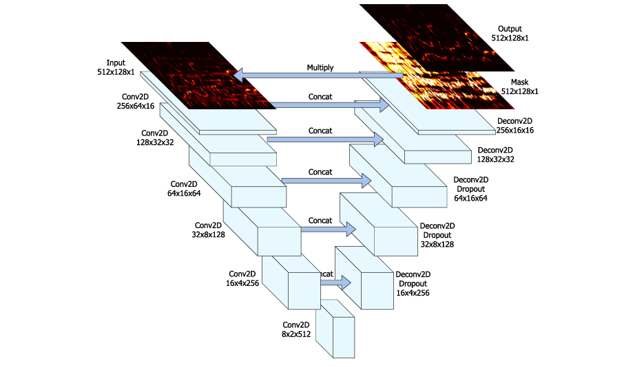
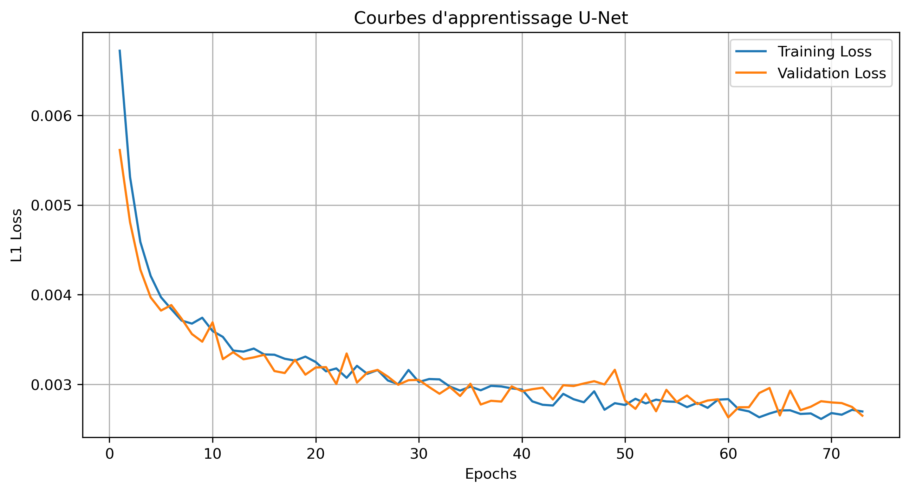
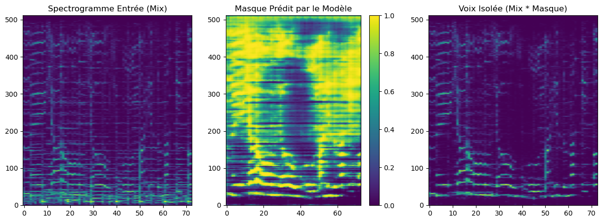

# Voice_Separation_with_Unet

## Project Overview

The goal of this project is to perform **Blind Source Separation (BSS)** on monaural and stereo recordings. By feeding the magnitude spectrogram of a mixed track into a symmetric encoder-decoder network, the model predicts a "soft mask" which isolates the vocal frequencies.

**Key Technical Achievements:**

* **Custom U-Net Implementation:** Built a 12-layer fully convolutional network with skip connections from scratch in PyTorch.
* **Audio Signal Processing:** Implemented a robust STFT/iSTFT pipeline handling complex phase reconstruction and padding strategies for variable-length audio.
* **Efficient Data Loading:** Developed a custom `IterableDataset` wrapping the `musdb` library to handle on-the-fly spectrogram generation and normalization.

---

## Model Architecture

The core architecture is a **U-Net** adapted for audio frequency data. It consists of an Encoder (downsampling) to capture context and a Decoder (upsampling) to localize features, linked by **Skip Connections** to preserve fine-grained spectral details required for high-fidelity audio reconstruction.

* **Input:** 512x128 Magnitude Spectrogram (approx. 11s context).
* **Encoder:** 6 layers of 2D Convolutions (5x5 kernel, stride 2) + Batch Normalization + LeakyReLU.
* **Decoder:** 6 layers of Transposed Convolutions + Batch Normalization + ReLU + Dropout (50% on first 3 layers).
* **Output:** Sigmoid activation generating a mask value [0, 1] for each Time-Frequency bin.

*Figure 1: Diagram of the implemented U-Net architecture showing skip connections and tensor dimensions.*

---

## Dataset & Preprocessing

The model was trained on the **MUSDB18** dataset, a standard benchmark for music source separation.

* **Sampling Rate:** Downsampled to **8192 Hz** (focusing on vocal range 0-4kHz).
* **STFT Parameters:** `n_fft=1024`, `hop_length=768`.
* **Normalization:** Magnitude spectrograms normalized to [0, 1] range per sample.
* **Data Augmentation:** Random time-slicing of tracks during training.

---

## Training Results

The model was trained using the **L1 Loss** (Mean Absolute Error) between the predicted vocal spectrogram and the ground truth.

* **Optimizer:** Adam (`lr=1e-4`)
* **Batch Size:** 16
* **Convergence:** The model reached a validation loss plateau of **~0.0026** after 75 epochs, showing strong generalization capabilities without significant overfitting.

*Figure 2: Training and Validation Loss curves showing consistent convergence.*

---

## Visualizing Separation

To qualitatively assess the model, we visualize the spectral masking process on an unseen test track (*"Enda Reilly - Cur An Long Ag Seol"*).

*Figure 3: Inference results. **Left:** Input Mix Spectrogram. **Center:** Predicted Soft Mask (lighter areas indicate vocals). **Right:** Resulting Isolated Vocal Spectrogram.*

---

## References

1. **Jansson et al.** "Singing Voice Separation with Deep U-Net Convolutional Networks", ISMIR 2017. [Link](https://openaccess.city.ac.uk/id/eprint/19289/)

2. **Ronneberger et al.** "U-Net: Convolutional Networks for Biomedical Image Segmentation", MICCAI 2015.

3. **MUSDB18 Dataset:** [MUSDB18 | SigSep](https://sigsep.github.io/datasets/musdb.html)

---

### Author

**Massyl ADJAL**

*Deep Learning Engineer*

[LinkedIn](https://www.linkedin.com/in/a-massyl/) | [GitMass (Massyl A.) · GitHub](https://github.com/GitMass)